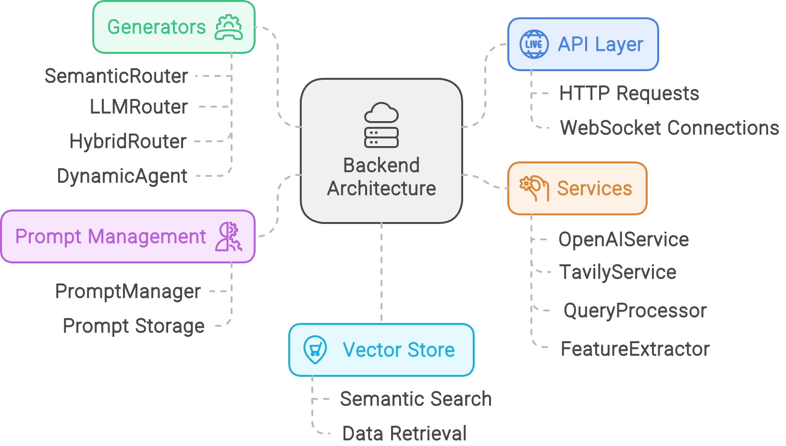
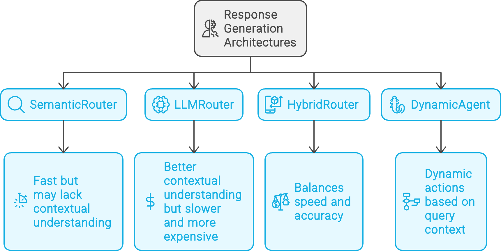
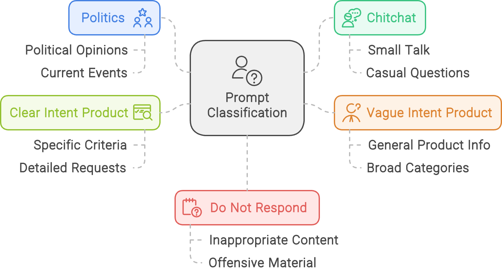

# BoardBot Backend

## Overview

BoardBot is an AI-powered system designed to assist users with queries about computer hardware products, particularly focusing on embedded systems, development kits, and industrial communication devices. This backend provides the core functionality for processing user queries, managing product data, and generating relevant responses.

## Table of Contents

- [BoardBot Backend](#boardbot-backend)
  - [Overview](#overview)
  - [Table of Contents](#table-of-contents)
  - [Project Structure](#project-structure)
  - [Architecture Overview](#architecture-overview)
  - [Components Breakdown](#components-breakdown)
    - [1. API Layer](#1-api-layer)
    - [2. Generators](#2-generators)
    - [3. Services](#3-services)
    - [4. Prompt Management](#4-prompt-management)
  - [Prompt Classification](#prompt-classification)
    - [Classification Categories](#classification-categories)
  - [Request Types and Responses](#request-types-and-responses)
    - [WebSocket Requests](#websocket-requests)
      - [1. Text Message Request](#1-text-message-request)
      - [Response](#response)
    - [HTTP Requests](#http-requests)
      - [1. Get Products (with pagination)](#1-get-products-with-pagination)
      - [2. Add Raw Product](#2-add-raw-product)
  - [Product Data](#product-data)
  - [Response Generation Architectures](#response-generation-architectures)
  - [Weaviate Vector Store](#weaviate-vector-store)
  - [Setup and Configuration](#setup-and-configuration)
  - [Running the Application](#running-the-application)
  - [Contributing](#contributing)
  - [License](#license)

## Project Structure

```
[FastAPI Application]
|
+-- [API Layer]
|   |
|   +-- routes.py
|   +-- socketio_handlers.py
|
+-- [Core]
|   |
|   +-- message_processor.py
|   +-- session_manager.py
|
+-- [Generators]
|   |
|   +-- base_router.py
|   +-- clear_intent_agent.py
|   +-- dynamic_agent.py
|   +-- hybrid_router.py
|   +-- llm_router.py
|   +-- semantic_router.py
|   +-- vague_intent_agent.py
|
+-- [Services]
|   |
|   +-- agentic_feature_extractor.py
|   +-- openai_service.py
|   +-- query_processor.py
|   +-- simple_feature_extractor.py
|   +-- tavily_service.py
|   +-- weaviate_service.py
|
+-- [Prompts]
|   |
|   +-- prompt_manager.py
|   +-- templates.py
|
+-- [Models]
|   |
|   +-- message.py
|   +-- product.py
|
+-- [Weaviate]
|   |
|   +-- weaviate_interface.py
|   +-- weaviate_client.py
|   +-- schema_manager.py
|   +-- product_service.py
|   +-- route_service.py
|   +-- http_client.py
|   |
|   +-- [Utils]
|       |
|       +-- graphql_query_builder.py
|       +-- where_clause_builder.py
|
+-- [Utils]
|   |
|   +-- response_formatter.py
|
+-- config.py
+-- containers.py
+-- dependencies.py
+-- main.py
```

## Architecture Overview

The backend is built using FastAPI and follows a modular architecture with the following main components:

1. **API Layer**: Handles incoming HTTP requests and WebSocket connections.
2. **Generators**: Manage query classification, routing, and response generation.
3. **Services**: Provide core functionalities like database interactions and external API calls.
4. **Prompt Management**: Centralized management of AI prompts.
5. **Vector Store**: Weaviate-based storage for efficient semantic search and retrieval.



## Components Breakdown

### 1. API Layer

- **FastAPI App**: The main entry point for the application.
- **Socket.IO**: Handles real-time communication with the frontend.

### 2. Generators

- **LLMRouter**: Uses language models for query classification.
- **SemanticRouter**: Employs semantic search for query classification.
- **HybridRouter**: Combines semantic search and language models for classification.
- **ClearIntentAgent**: Handles queries with clear product-related intent.
- **VagueIntentAgent**: Processes queries with vague product-related intent.
- **DynamicAgent**: Adapts its approach based on the query context.



### 3. Services

- **OpenAIService**: Manages interactions with OpenAI's language models.
- **WeaviateService**: Handles vector database operations.
- **TavilyService**: Provides internet search capabilities.
- **QueryProcessor**: Processes and expands user queries.
- **FeatureExtractor**: Extracts product features from raw data.

### 4. Prompt Management

- **PromptManager**: Centralizes the management of AI prompts used throughout the system.

## Prompt Classification

BoardBot uses a sophisticated prompt classification system to route user queries to the most appropriate handling mechanism. This classification is crucial for providing accurate and relevant responses. Here's an overview of the classification categories and their criteria:

### Classification Categories

1. **Politics**

   - For queries primarily related to political topics.
   - Example: "What's your opinion on the current political situation?"

2. **Chitchat**

   - For general conversation or small talk unrelated to products.
   - Example: "How's the weather today?"

3. **Vague Intent Product**

   - For product-related queries that are general or lack specific criteria.
   - Examples:
     - "Tell me about single board computers"
     - "What are some good development kits?"
     - "I'm looking for industrial communication devices"

4. **Clear Intent Product**

   - For product-related queries with specific criteria or constraints.
   - Examples:
     - "Find me a board with an Intel processor and at least 8GB of RAM"
     - "List Single Board Computers with a processor frequency of 1.5 GHz or higher"
     - "What are the top 5 ARM-based development kits with built-in Wi-Fi?"

5. **Do Not Respond**
   - For queries that are inappropriate, offensive, or completely unrelated to computer hardware and embedded systems.
   - Example: "Tell me an inappropriate joke"



## Request Types and Responses

### WebSocket Requests

The backend primarily communicates with the frontend through WebSocket connections. Here are the main types of requests and their expected formats:

#### 1. Text Message Request

```json
{
  "type": "textMessage",
  "sessionId": "unique_session_id",
  "messageId": "unique_message_id",
  "message": "User's query text",
  "isComplete": true,
  "timestamp": "2024-08-21T07:12:16.535Z",
  "model": "gpt-4o",
  "architectureChoice": "llm-router",
  "historyManagementChoice": "keep-all"
}
```

#### Response

```json
{
  "session_id": "unique_session_id",
  "messageId": "unique_message_id_response",
  "message": {
    "type": "clear_intent_product",
    "message": "Response message",
    "products": [
      {
        "name": "Product Name",
        "description": "Product description"
      }
    ],
    "reasoning": "Reasoning for the response",
    "follow_up_question": "Follow-up question",
    "metadata": {
      "classification_result": {},
      "reranking_result": {}
    },
    "input_token_usage": {
      "expansion": 100,
      "rerank": 50,
      "generate": 200
    },
    "output_token_usage": {
      "expansion": 50,
      "rerank": 25,
      "generate": 150
    },
    "time_taken": {
      "expansion": 0.5,
      "search": 0.2,
      "rerank": 0.3,
      "generate": 1.0
    }
  },
  "timestamp": "2024-08-21T07:12:18.123Z",
  "isComplete": true,
  "inputTokenCount": 350,
  "outputTokenCount": 225,
  "elapsedTime": 2.0,
  "isUserMessage": false,
  "model": "gpt-4o"
}
```

### HTTP Requests

The backend also provides RESTful APIs for product management:

#### 1. Get Products (with pagination)

```
GET /products?limit=10&offset=0
```

Response:

```json
{
  "total": 1000,
  "limit": 10,
  "offset": 0,
  "products": [
    {
      "id": "product_id",
      "name": "Product Name",
      "manufacturer": "Manufacturer Name",
      "form_factor": "Form Factor",
      "processor": "Processor Type"
    }
  ]
}
```

#### 2. Add Raw Product

```
POST /products/raw
Content-Type: application/json

{
  "raw_data": "Raw product description text",
  "extractor_type": "agentic"
}
```

Response:

```json
{
  "id": "newly_created_product_id"
}
```

## Product Data

The system works with detailed product data for computer hardware, particularly embedded systems, development kits, and industrial communication devices. Each product entry includes the following attributes:

- name: The official product name
- manufacturer: The company producing the product
- form_factor: Physical dimensions or form factor
- processor: Specific processor model and architecture
- core_count: Number of processor cores
- processor_tdp: Thermal Design Power of the processor
- memory: Memory specifications
- io: Input/Output interfaces
- operating_system: Supported operating systems
- environmentals: Environmental specifications (e.g., operating temperature)
- certifications: Product certifications
- short_summary: Brief product overview
- full_summary: Comprehensive product summary
- full_product_description: Detailed product description

## Response Generation Architectures

The backend supports four main architectures for response generation:

1. **SemanticRouter**: Uses semantic search in the vector database to classify queries and route them to appropriate handlers. Fast but may lack contextual understanding for complex queries.

2. **LLMRouter**: Employs language models to classify queries. Provides better contextual understanding but may be slower and more expensive than semantic search.

3. **HybridRouter**: Combines semantic search and language models. It first attempts semantic search and falls back to LLM if the confidence is low, balancing speed and accuracy.

4. **DynamicAgent**: An adaptive approach that doesn't pre-classify queries but dynamically chooses actions based on the query context. It can perform query expansion, semantic search, or direct response generation as needed.

## Weaviate Vector Store

The backend uses Weaviate as a vector database to store and retrieve product information efficiently. The vector store contains:

1. **Product Data**: Vectorized representations of product information, allowing for semantic search and retrieval.

2. **Route Data**: Example prompts and their corresponding routes, used by the SemanticRouter for query classification.

The schema for the Weaviate classes is defined in `schema.json`, specifying the structure for both Product and Route classes.

## Setup and Configuration

1. Clone the repository:

   ```
   git clone https://github.com/get10acious/ThroughPut
   cd ThroughPut/backend
   ```

2. Set up a virtual environment:

   ```
   python3 -m venv .venv
   source .venv/bin/activate
   ```

3. Install dependencies:

   ```
   pip install -r requirements.txt
   ```

4. Set up environment variables:
   Create a `.env` file in the project root with the following variables:

   ```
   OPENAI_API_KEY=your_openai_api_key
   WEAVIATE_URL=your_weaviate_url
   TAVILY_API_KEY=your_tavily_api_key
   ```

5. Initialize Weaviate:
   Follow Weaviate's documentation to set up and run a Weaviate instance.

## Running the Application

To start the ThroughPut server:

```
python main.py
```

This will start the FastAPI server with Socket.IO support.

## Contributing

1. Fork the repository.
2. Create a new branch for your feature or bug fix.
3. Make your changes and commit them with a clear commit message.
4. Push your changes to your fork.
5. Submit a pull request to the main repository.

## License

This project is licensed under the MIT License. See the `LICENSE` file for details.
